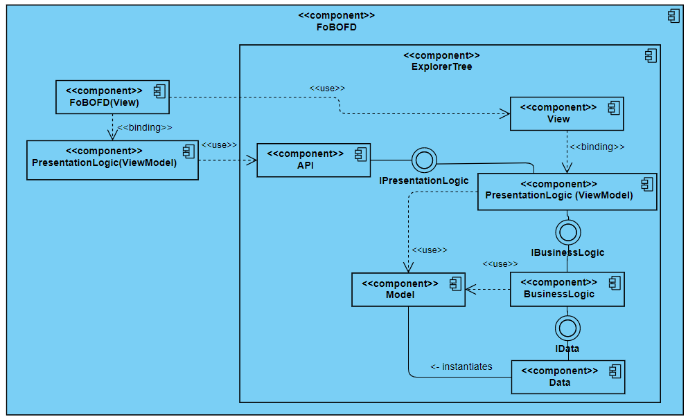

# FoBOFD
FoBOFD: supports you to create your own file and/or directory dialog with WPF.

## Project description

FoBOFD means: FolderBrowser-OpenFile-Dialog

* FoBOFD should help you to create the Windows Forms dialogs FolderBrowserDialog and OpenFileDialog in WPF.
* To enable the user to load file system elements it is sufficient to visualize the file system as a tree structure.
* Therefore the core component of FoBOFD is the ExplorerTree Component (ETC).

## Table of contents
[1. Personal Goals](#1-personal-goals)  
[2. Goals and Requirements](#2-goals-and-requirements)  
[3. Architecture](#3-architecture)  
[4. The ExplorerTree Component (ETC)](#4-the-explorertree-component)  
&nbsp;&nbsp;&nbsp;&nbsp;[4.1. API description](#41-api-description)  
&nbsp;&nbsp;&nbsp;&nbsp;[4.2. Architecture](#42-architecture)  
[5. MultiselectTreeView](#5-multiselecttreeview)  
[6. Technology stack](#6-technology-stack)  

## 1. Personal Goals 

The personal goals are the main reason why i started this project.  
Thus the focus is on the methodology and not on the completion itself.

* Improve my software development skills - not only coding ;) 
* Improve and learn more about Test Driven Development (TDD)
* Giving something back to the community. 

## 2. Goals and Requirements
* The FoBOFD shall provide the user with the ability to select and load filesystem elements.
* The ETC shall be able to display all available file system elements of the operating system.	
* The ETC shall provide the programmer with the ability to configure the ETC during runtime.

## 3. Architecture

The architecture of FoBOFD combines a classical layer architecture with the MVVM pattern.  
FoBOFD itself does not require a data layer and business layer.  
The subcomponent ExplorerTreeView also combines a classical layer architecture with the MVVM pattern.  

  

## 4. The ExplorerTree Component 

The ExplorerTree Component (ETC) is implemented in the ExplorerTree.dll.  
It is also possible to include only the ExplorerTree-Component in a project,  
to create your own dialogs to load files and folders.  
For this purpose this component provides an Application-Programming-Interface (API).  
The API allows an dynamic configuration of the explorer tree during runtime.  
For example the icon and text size can be configured. 

### 4.1. API description
* coming soon

### 4.2. Architecture
* coming soon

## 5. MultiselectTreeView 
MultiselectTreeView is a third party a project.  
But it has not been developed further for a long time.  
Furthermore it is buggy and in my opinion not sufficiently tested.  
Therefore I integrated it directly into the codebase and not via Nuget.  
This project should be refactored and sufficiently tested.

## 6. Technology stack
* C# (.Net Framework 4.7.2)
* Windows Presentation Foundation (WPF)
* Visual Studio Community 2019
* NUnit
* NSubstitute
